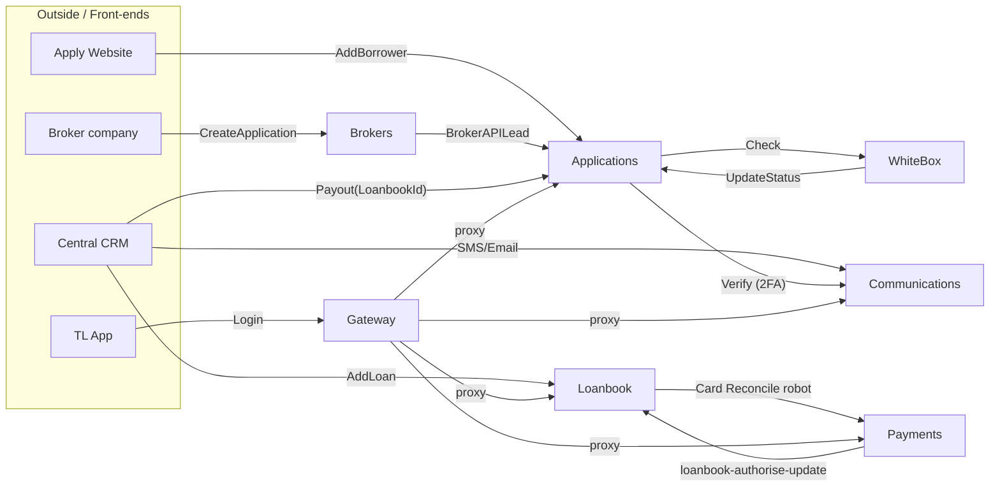
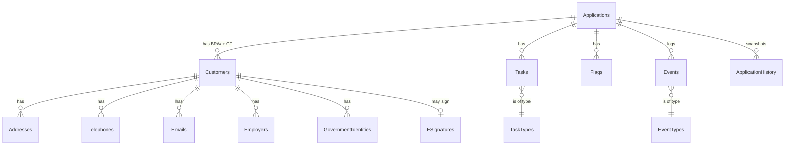
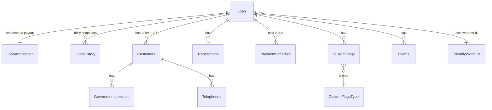
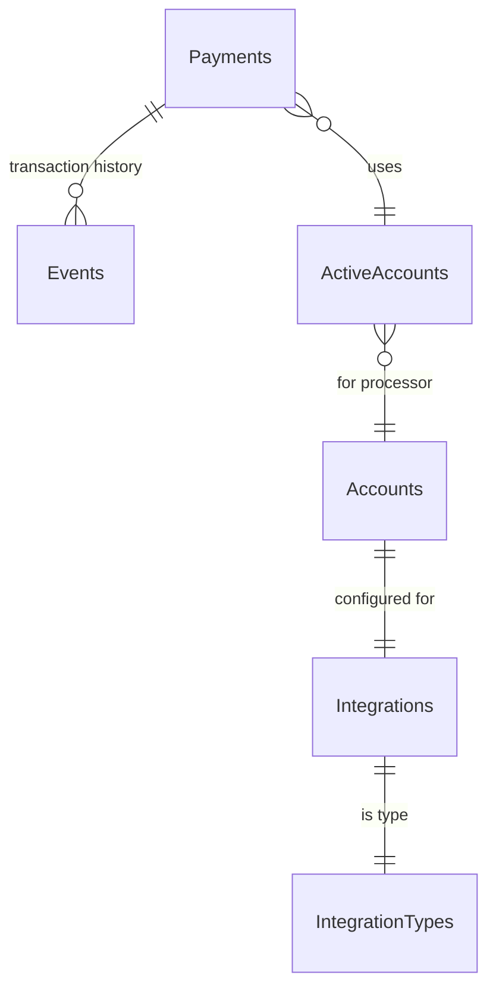
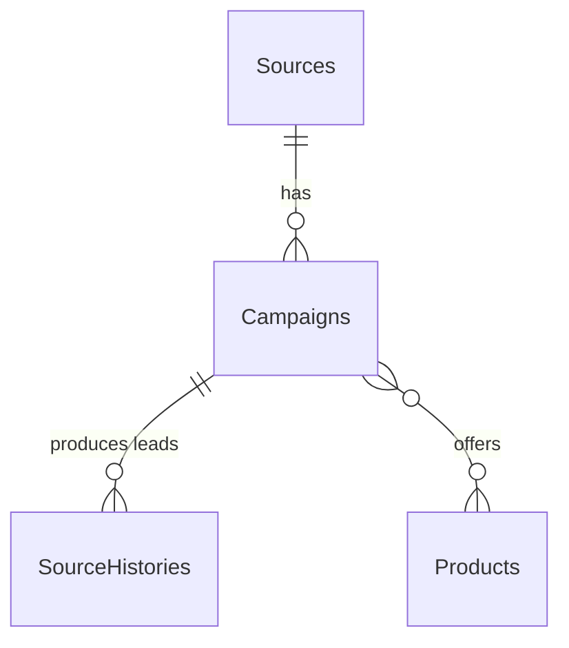
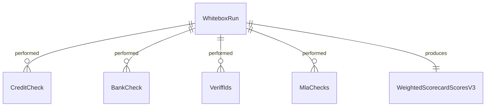

# Database Schema

_The complete table structure for our platform's databases, with realistic example data, and diagrams showing how everything connects. Reference for spec-writing._

---

## 1. The canonical example we use throughout

Every sample row in this doc is consistent with **one customer journey**. Wherever you see a value below, it's the same value referenced in every relevant table — so you can trace it through the platform.

| Concept | Value | Notes |
|---|---|---|
| **Lender** | `LenderId = 6` | Together Loans / TransformCredit (TL/TC), USA, `TimeOffset = +360` (UTC-6) |
| **Source** | `SourceId = 421`, name `BestLoans` | Affiliate broker |
| **Campaign** | `CampaignId = 12345`, code `BL_2026Q2` | One of BestLoans' campaigns |
| **ARef** | `0635311333050423022620` | Application reference |
| **GtRef** | `1` | The active guarantor on this application |
| **CustomerId (Apps)** | `448291` (BRW), `448292` (GT) | Internal Applications DB key |
| **LoanbookId** | `010100AQUA` | Live loan after payout |
| **CustomerId (Loanbook)** | `9821` (BRW), `9822` (GT) | **Different from Applications' CustomerId** |
| **BRW** | Bob Smith, DOB 1985-04-12 | SSN 123-45-6789 |
| **GT** | Sarah Smith (sister), DOB 1988-09-23 | SSN 234-56-7890, RelationToBrw = 4 |
| **Loan** | $5,000 principal, 36 months, 36% APR | Monthly, RegularPaymentAmount $228.30 |
| **Payout** | 2026-04-22 16:00 UTC (10:00 local) | After WhiteboxRun = 8421 approved |
| **Card** | `PaymentId = 98214`, Visa •••• 4242, exp 12/2028 | Tokenised by BridgePay |
| **Bank** | `PaymentId = 98215`, Wells Fargo •••• 6789 | Routing 121000248 |
| **WhiteboxRun** | `8421` | Decision Approved |
| **First Payment** | $228.30 on 2026-05-22 | Card 4242, success |

---

## 2. Cross-service overview

How the major identifiers flow between services. Every arrow is a *write* that creates a record in another service's tables.

**ID ownership at a glance:**

| ID | Owned by | Visible to |
|---|---|---|
| `LenderId` | Central Security | Every service |
| `ARef` | Central Applications | Brokers, Loanbook (after payout), CRM, Comms, White Box |
| `CustomerId` (Apps) | Central Applications | Apps only |
| `LoanbookId` | Central Loanbook | Apps (writeback), Payments, Comms, CRM |
| `CustomerId` (Loanbook) | Central Loanbook | Loanbook only — **distinct from Apps** |
| `GtRef` | Central Applications | Every service |
| `PaymentId` | Central Payments | Payments only |
| `MessageId` | Central Communications | Comms only |
| `CampaignId` | Brokers (broker campaigns), Message Factory (msg campaigns) | Two distinct namespaces |
| `WhiteboxRunId` | Lender White Box | White Box only |

---

## 3. Central Applications

`applications.api.rgcore.com` · Audit channel: `rgcore-applications`

The source of truth for an application from submission through payout. ARef-keyed.

### 3.1 ER Diagram

### 3.2 Applications

The application itself.

| Field | Type | Example | Notes |
|---|---|---|---|
| `ARef` | NVARCHAR(22) **PK** | `0635311333050423022620` | 22 chars; embeds country code |
| `LenderId` | INT FK | `6` | Tenant key |
| `LoanbookId` | NVARCHAR(10) | `010100AQUA` | NULL until payout; written by `Payout` endpoint |
| `GtRef` | INT | `1` | Active guarantor (NULL until GT added) |
| `BrwCustomerId` | INT FK | `448291` | → Customers |
| `GtCustomerId` | INT FK | `448292` | → Customers (NULL if no GT) |
| `BrwEsignatureId` | INT FK | `78201` | → ESignatures |
| `GtEsignatureId` | INT FK | `78202` | → ESignatures |
| `BrwDSS` | DATETIME2 | `2026-04-15 14:42:00` | BRW digital sign stamp |
| `GtDSS` | DATETIME2 | `2026-04-18 11:15:00` | GT digital sign stamp |
| `ApplicationStatusId` | INT | `4` | 1 Lead · 2 NoGt · 3 Columbo · 4 VcReady · 5 LiveLoan · 6 BrwDeclined · 7 DNL |
| `GSBStatus` | INT | `2` | ID + bank-check progress |
| `TueStatus` | BIT | `0` | True if top-up |
| `LoanAmountRequested` | DECIMAL(18,2) | `5000.00` | Customer's requested amount |
| `TermRequested` | INT | `36` | Months |
| `SourceId` | INT FK | `421` | → Brokers.Sources |
| `CampaignId` | INT FK | `12345` | → Brokers.Campaigns |
| `DateCreatedUtc` | DATETIME2 | `2026-04-15 14:32:00` | |
| `DateCreatedLocal` | DATETIME2 | `2026-04-15 08:32:00` | Local = UTC + TimeOffset |

### 3.3 Customers

| Field | Type | Example (BRW) | Notes |
|---|---|---|---|
| `CustomerId` | INT **PK** | `448291` | Apps-internal key |
| `ARef` | NVARCHAR(22) FK | `0635311333050423022620` | |
| `LenderId` | INT | `6` | |
| `GtRef` | INT | `NULL` | NULL = BRW; non-NULL = GT |
| `RelationToBrw` | INT | `NULL` (BRW), `4` (GT = Sister) | Enum: 1 Friend · 2 Mother · 3 Father · 4 Sister · 5 Brother · etc. |
| `FirstName` | NVARCHAR(100) | `Bob` | |
| `MiddleName` | NVARCHAR(100) | `James` | |
| `Surname` | NVARCHAR(100) | `Smith` | |
| `DateOfBirth` | DATE | `1985-04-12` | |
| `Sex` | CHAR(1) | `M` | M / F / NULL |
| `LanguageId` | INT FK | `1` | 1 = English |
| `DoNotMarket` | BIT | `0` | |
| `DateCreatedUtc` | DATETIME2 | `2026-04-15 14:32:00` | |
| `DateCreatedLocal` | DATETIME2 | `2026-04-15 08:32:00` | |

### 3.4 Addresses

| Field | Type | Example | Notes |
|---|---|---|---|
| `AddressId` | INT **PK** | `882041` | |
| `CustomerId` | INT FK | `448291` | |
| `AddressType` | INT | `1` | 0 Unknown · 1 Current · 2 Previous · 3 Owned · 4 DoNotUse |
| `AddressLine1` | NVARCHAR(200) | `742 Evergreen Terrace` | |
| `AddressLine2` | NVARCHAR(200) | `NULL` | |
| `City` | NVARCHAR(100) | `Springfield` | |
| `State` | NVARCHAR(50) | `IL` | |
| `Postcode` | NVARCHAR(20) | `62701` | |
| `AddressDoNotMarket` | BIT | `0` | |
| `DateCreatedUtc` | DATETIME2 | `2026-04-15 14:32:00` | |
| `DateCreatedLocal` | DATETIME2 | `2026-04-15 08:32:00` | |

### 3.5 Telephones

| Field | Type | Example | Notes |
|---|---|---|---|
| `TelephoneId` | INT **PK** | `771203` | |
| `CustomerId` | INT FK | `448291` | |
| `Type` | INT | `1` | 1 Mobile · 2 Home · 3 Work · 4 Other · 5 DoNotUse |
| `Number` | NVARCHAR(50) | `+15550123456` | E.164 |
| `DoNotUse` | BIT | `0` | |
| `DoNotMarket` | BIT | `0` | |
| `DateCreatedUtc` | DATETIME2 | `2026-04-15 14:32:00` | |
| `DateCreatedLocal` | DATETIME2 | `2026-04-15 08:32:00` | |

### 3.6 Emails

| Field | Type | Example | Notes |
|---|---|---|---|
| `EmailId` | INT **PK** | `551422` | |
| `CustomerId` | INT FK | `448291` | |
| `Email` | NVARCHAR(255) | `bob.smith@example.com` | |
| `DoNotUse` | BIT | `0` | |
| `DoNotMarket` | BIT | `0` | |
| `DateCreatedUtc` | DATETIME2 | `2026-04-15 14:32:00` | |
| `DateCreatedLocal` | DATETIME2 | `2026-04-15 08:32:00` | |

### 3.7 Employers

| Field | Type | Example | Notes |
|---|---|---|---|
| `EmployerId` | INT **PK** | `301044` | |
| `CustomerId` | INT FK | `448291` | |
| `EmployerName` | NVARCHAR(200) | `Springfield Power Plant` | |
| `JobTitle` | NVARCHAR(200) | `Safety Inspector` | |
| `IncomeAnnual` | DECIMAL(18,2) | `48000.00` | |
| `LengthOfEmploymentMonths` | INT | `42` | |
| `DateCreatedUtc` | DATETIME2 | `2026-04-15 14:32:00` | |
| `DateCreatedLocal` | DATETIME2 | `2026-04-15 08:32:00` | |

### 3.8 GovernmentIdentities

| Field | Type | Example | Notes |
|---|---|---|---|
| `GovernmentIdentityId` | INT **PK** | `998021` | |
| `CustomerId` | INT FK | `448291` | One per type per customer (max) |
| `Type` | INT | `1` | 1 SSN · 2 ITIN · 3 DriversLicense · etc. |
| `IdentityNumber` | NVARCHAR(50) | `123456789` | Stored encrypted; blanked by Sensitive Data Deleter after `DSIT > 60` |
| `DateCreatedUtc` | DATETIME2 | `2026-04-15 14:32:00` | |
| `DateCreatedLocal` | DATETIME2 | `2026-04-15 08:32:00` | |

### 3.9 ESignatures

| Field | Type | Example | Notes |
|---|---|---|---|
| `EsignatureId` | INT **PK** | `78201` | |
| `CustomerId` | INT FK | `448291` | |
| `LoanbookId` | NVARCHAR(10) | `010100AQUA` | Written here at payout via `Payout` endpoint |
| `IpAddress` | NVARCHAR(50) | `203.0.113.42` | |
| `UserAgent` | NVARCHAR(500) | `Mozilla/5.0 (Macintosh; Intel Mac OS X)…` | |
| `DateSignedUtc` | DATETIME2 | `2026-04-15 14:42:00` | |
| `DateSignedLocal` | DATETIME2 | `2026-04-15 08:42:00` | |

### 3.10 Tasks

| Field | Type | Example | Notes |
|---|---|---|---|
| `TaskId` | INT **PK** | `2010447` | |
| `ARef` | NVARCHAR(22) FK | `0635311333050423022620` | |
| `GtRef` | INT | `NULL` (BRW task) | NULL → BRW; non-NULL → GT |
| `TaskTypeId` | INT FK | `54` | → TaskTypes |
| `Description` | NVARCHAR(500) | `CreditCheck:All` | |
| `DateCreatedUtc` | DATETIME2 | `2026-04-15 15:00:00` | |
| `DateCreatedLocal` | DATETIME2 | `2026-04-15 09:00:00` | |
| `DateCompletedUtc` | DATETIME2 | `2026-04-18 11:30:00` | NULL while outstanding |
| `DateCompletedLocal` | DATETIME2 | `2026-04-18 05:30:00` | |
| `ClientType` | NVARCHAR(50) | `TogetherLoansWhitebox` | |
| `ClientUsername` | NVARCHAR(100) | `whitebox-system` | |

### 3.11 Flags

| Field | Type | Example | Notes |
|---|---|---|---|
| `FlagId` | INT **PK** | `441290` | |
| `ARef` | NVARCHAR(22) FK | `0635311333050423022620` | |
| `GtRef` | INT | `NULL` | |
| `FlagTypeId` | INT | `2` | 1 Training · 2 Decline · 3 DNL · 4 Cancelled · 5 Complaint · 6 FraudRisk · 7 PushBack · ≥8 lender-defined |
| `Reason` | NVARCHAR(500) | `Failed bank verification` | |
| `DateAddedUtc` | DATETIME2 | `2026-04-15 15:00:00` | |
| `DateAddedLocal` | DATETIME2 | `2026-04-15 09:00:00` | |
| `DateRemovedUtc` | DATETIME2 | `NULL` | NULL = active |
| `DateRemovedLocal` | DATETIME2 | `NULL` | |
| `ClientType` | NVARCHAR(50) | `TogetherLoansCRM` | |
| `ClientUsername` | NVARCHAR(100) | `james@rgroup.co.uk` | |

### 3.12 Events

Append-only.

| Field | Type | Example | Notes |
|---|---|---|---|
| `EventId` | BIGINT **PK** | `1100884` | |
| `ARef` | NVARCHAR(22) FK | `0635311333050423022620` | |
| `GtRef` | INT | `NULL` | |
| `EventTypeId` | INT FK | `27` | → EventTypes (`ApplicationPaidOut`) |
| `Description` | NVARCHAR(MAX) | `{"LoanbookId":"010100AQUA","Amount":5000}` | JSON payload |
| `DateCreatedUtc` | DATETIME2 | `2026-04-22 16:00:00` | |
| `DateCreatedLocal` | DATETIME2 | `2026-04-22 10:00:00` | |
| `ClientType` | NVARCHAR(50) | `TogetherLoansCRM` | |
| `ClientUsername` | NVARCHAR(100) | `james@rgroup.co.uk` | |

### 3.13 TaskTypes / EventTypes (reference tables)

`TaskTypes`: `41 Details:All` · `48 Sign:All` · `54 CreditCheck:All` · `55 CreditCheck:ColumboPage` · `57 Bank:All` · `62 VerbalContract(GT)` · `63 Payout` · `65 CaseworkerReview` · `73 FraudCheck:All` · `103 BankCheck:All` · `127 Payout:Approved` · `134 DirectIdReview` · `135 Payout:Ready` · `138 ID:Verify` · `144 PendingPayoff:All` · `146 VerbalContract(BRW)` · `149 BankCheck:Savings`

`EventTypes` (selected): `15 FriendlyWordRequest` · `27 ApplicationPaidOut` · `28 LoanPaidOut` · `33 GuarantorReinstated` · `99 Note`

---

## 4. Central Loanbook

`loanbook.api.rgcore.com` · Audit channel: `rg-core-loanbook` (every table tamper-protected)

The source of truth for live loans. **Note: `Loanbook.CustomerId` is a separate key from `Applications.CustomerId`.**

### 4.1 ER Diagram

### 4.2 Loan

| Field | Type | Example | Notes |
|---|---|---|---|
| `LoanbookId` | NVARCHAR(10) **PK** | `010100AQUA` | Algorithm: `LenderId + DOB-formatted + LanguageId + FriendlyWord` |
| `LenderId` | INT FK | `6` | |
| `ARef` | NVARCHAR(22) | `0635311333050423022620` | Informational copy |
| `GtRef` | INT | `1` | |
| `LoanAmount` | DECIMAL(18,2) | `5000.00` | |
| `Term` | INT | `36` | Months |
| `RegularPaymentAmount` | DECIMAL(18,2) | `228.30` | |
| `RegularPaymentDay` | INT | `22` | 1–31 or day-of-week |
| `PaymentFrequencyId` | INT | `4` | 1 Weekly · 2 TwoWeekly · 3 FourWeekly · 4 Monthly |
| `RateOnPrincipal` | DECIMAL(7,5) | `0.36000` | 36% APR |
| `RateOnArrears` | DECIMAL(7,5) | `0.36000` | |
| `RateOnFees` | DECIMAL(7,5) | `0.00000` | |
| `RateOnInterest` | DECIMAL(7,5) | `0.00000` | |
| `LoanAgreementDateLocal` | DATETIME2 | `2026-04-22 10:00:00` | |
| `LoanAgreementDateUtc` | DATETIME2 | `2026-04-22 16:00:00` | |
| `FirstPaymentDate` | DATE | `2026-05-22` | |
| `TUEStatus` | CHAR(1) | `N` | |
| `TUE_MaxBalance` | DECIMAL(18,2) | `2500.00` | |
| `TUE_ArrearsPosition` | INT | `0` | |
| `TUEDaysOld` | INT | `90` | |
| `CurrencyId` | INT | `2` | 1 GBP · 2 USD · 3 EUR · 4 CAD |
| `CurrentBalance` | DECIMAL(18,2) | `4843.20` | Updated by Mini + Daily Update |
| `CurrentArrears` | DECIMAL(18,2) | `0.00` | |
| `CurrentPrincipal` | DECIMAL(18,2) | `4815.00` | |
| `CurrentInterest` | DECIMAL(18,2) | `28.20` | |
| `CurrentFees` | DECIMAL(18,2) | `0.00` | |
| `CurrentDateInArrearsLocal` | DATETIME2 | `NULL` | |
| `Scribble` | NVARCHAR(100) | `Bob's a good payer 👍` | Max 100 chars incl. emoji |
| `Allocate` | BIT | `0` | Controlled by DU |
| `Owner` | NVARCHAR(75) | `NULL` | Controlled by DU |
| `TestLoan` | BIT | `0` | |
| `ProductTypeId` | INT | `20` | 20 TC on Checkout · 23 Medical · 24 Medallion |
| `CampaignId` | INT | `12345` | Originating campaign |

### 4.3 LoanAtInception

Immutable snapshot at payout — never updated.

| Field | Type | Example | Notes |
|---|---|---|---|
| `LoanbookId` | NVARCHAR(10) **PK** | `010100AQUA` | |
| `LoanAmountAtInception` | DECIMAL(18,2) | `5000.00` | |
| `LoanTermAtInception` | INT | `36` | |
| `RegularPaymentAmount` | DECIMAL(18,2) | `228.30` | |
| `RegularPaymentDay` | INT | `22` | |
| `PaymentFrequency` | INT | `4` | |
| `FirstPaymentDate` | DATE | `2026-05-22` | |
| `RateOnPrincipal` | DECIMAL(7,5) | `0.36000` | |
| `RateOnArrears` | DECIMAL(7,5) | `0.36000` | |
| `SetupFee` | DECIMAL(18,2) | `0.00` | |
| `MonthlyFee` | DECIMAL(18,2) | `0.00` | |
| `AnnualServicingFee` | DECIMAL(18,2) | `0.00` | |
| `BrwContract` | NVARCHAR(MAX) | `<full HTML of contract>` | |
| `GtContract` | NVARCHAR(MAX) | `<full HTML of contract>` | |
| `BrwArbitration` | NVARCHAR(MAX) | `<...>` | |
| `GtArbitration` | NVARCHAR(MAX) | `<...>` | |
| `StateCounty` | NVARCHAR(100) | `IL/Sangamon` | |
| `CampaignId` | INT | `12345` | |

### 4.4 LoanHistory

One row per Daily Update run + every Mini Update.

| Field | Type | Example | Notes |
|---|---|---|---|
| `LoanHistoryId` | BIGINT **PK** | `4490881` | |
| `LoanbookId` | NVARCHAR(10) FK | `010100AQUA` | |
| `Principal` | DECIMAL(18,2) | `4815.00` | |
| `Fees` | DECIMAL(18,2) | `0.00` | |
| `Interest` | DECIMAL(18,2) | `28.20` | |
| `Arrears` | DECIMAL(18,2) | `0.00` | |
| `IntraMonthInterest` | DECIMAL(18,2) | `2.85` | |
| `CurrentBalance` | DECIMAL(18,2) | `4843.20` | Principal + Fees + Interest |
| `DateInArrearsLocal` | DATETIME2 | `NULL` | |
| `DailyUpdate` | BIT | `1` | True if from DU, False from Mini |
| `DateTimeUtc` | DATETIME2 | `2026-05-23 06:00:00` | |
| `DateTimeLocal` | DATETIME2 | `2026-05-23 00:00:00` | |

### 4.5 Customers (Loanbook)

| Field | Type | Example (BRW) | Notes |
|---|---|---|---|
| `CustomerId` | INT **PK** | `9821` | **Distinct from Apps' CustomerId 448291** |
| `LoanbookId` | NVARCHAR(10) FK | `010100AQUA` | |
| `RelationToBrw` | INT | `NULL` (BRW), `4` (GT Sister) | |
| `FirstName` | NVARCHAR(100) | `Bob` | |
| `Surname` | NVARCHAR(100) | `Smith` | |
| `DateOfBirth` | DATE | `1985-04-12` | |
| `LanguageId` | INT | `1` | |
| `EsignatureId` | INT | `78201` | FK to Applications.ESignatures |
| `Sex` | CHAR(1) | `M` | |
| `DoNotMarket` | BIT | `0` | |

### 4.6 Transactions

| Field | Type | Example | Notes |
|---|---|---|---|
| `TransactionId` | BIGINT **PK** | `204891` | |
| `LoanbookId` | NVARCHAR(10) FK | `010100AQUA` | |
| `TransactionTypeName` | NVARCHAR(50) | `Repayment` | `Principal` (payout) · `Fee` · `Repayment` · `Refund` · `WriteOff` etc. |
| `TransactionAmount` | DECIMAL(18,2) | `228.30` | |
| `Description` | NVARCHAR(500) | `Monthly payment 1 of 36` | |
| `GtOrBrw` | CHAR(3) | `BRW` | |
| `Method` | NVARCHAR(20) | `Card` | |
| `DateTimeUtc` | DATETIME2 | `2026-05-22 14:00:00` | |
| `DateTimeLocal` | DATETIME2 | `2026-05-22 08:00:00` | |
| `ClientType` | NVARCHAR(50) | `AutoReconcileProcessor` | |
| `ClientUsername` | NVARCHAR(100) | `card-reconcile-robot` | |

### 4.7 PaymentSchedule

By design, **only the next 2 due** are stored.

| Field | Type | Example | Notes |
|---|---|---|---|
| `PaymentScheduleId` | INT **PK** | `883041` | |
| `LoanbookId` | NVARCHAR(10) FK | `010100AQUA` | |
| `ScheduledDate` | DATE | `2026-06-22` | |
| `Amount` | DECIMAL(18,2) | `228.30` | |
| `RegularPaymentType` | INT | `NULL` | NULL = normal · 1 OverdrawnAmount · 2 InterestOnly · 3 HalfInterestOnly |
| `IsNext` | BIT | `1` | First future scheduled |

### 4.8 CustomFlags / CustomFlagsType

`CustomFlags`:

| Field | Type | Example | Notes |
|---|---|---|---|
| `CustomFlagId` | INT **PK** | `771203` | |
| `LoanbookId` | NVARCHAR(10) FK | `010100AQUA` | |
| `CustomFlagTypeId` | INT FK | `2` | |
| `GtRef` | INT | `NULL` | |
| `Reason` | NVARCHAR(500) | `Decline` | |
| `DateAddedUtc` | DATETIME2 | `2026-04-15 15:00:00` | |
| `DateRemovedUtc` | DATETIME2 | `NULL` | NULL = active |
| `ClientType` | NVARCHAR(50) | `TogetherLoansCRM` | |
| `ClientUsername` | NVARCHAR(100) | `james@rgroup.co.uk` | |

`CustomFlagsType` reference (LenderId 6):

| `CustomFlagTypeId` | Name | FreezesPayments | FreezesInterest | FreezesDIA | PreventsContact |
|---|---|---|---|---|---|
| 1 | Training | 0 | 0 | 0 | 1 |
| 2 | Decline | 0 | 0 | 0 | 0 |
| 3 | DNL | 1 | 1 | 1 | 1 |
| 4 | Cancelled | 1 | 1 | 1 | 1 |
| 5 | Complaint | 0 | 0 | 0 | 0 |
| 6 | FraudRisk | 1 | 0 | 0 | 0 |
| 7 | PushBack | 0 | 0 | 0 | 0 |
| 12 | BankruptcyCh7 | 1 | 1 | 1 | 1 |
| 18 | MilitaryActiveDuty | 0 | 1 | 0 | 0 |

### 4.9 FriendlyWordList

| Field | Type | Example | Notes |
|---|---|---|---|
| `FriendlyWord` | NVARCHAR(20) **PK** | `AQUA` | Each unique within lender |
| `LenderId` | INT | `6` | |
| `Used` | BIT | `1` | True once used in a LoanbookId |
| `DateAdded` | DATE | `2024-01-15` | |

### 4.10 DailyUpdateStatus

| Field | Type | Example | Notes |
|---|---|---|---|
| `LenderId` | INT **PK** | `6` | One row per lender |
| `LastRunDateLocal` | DATE | `2026-05-23` | |
| `LastRunStartUtc` | DATETIME2 | `2026-05-23 06:00:00` | |
| `LastRunCompleteUtc` | DATETIME2 | `2026-05-23 06:14:31` | |
| `Status` | NVARCHAR(20) | `Complete` | `Running` · `Complete` · `Failed` |
| `LoansProcessed` | INT | `12047` | |

---

## 5. Central Payments

`payments.api.rgcore.com` · Audit channels: `rgcore-payments`, `rg-core-donotuse` (bank deactivations), `rg-core-autopayments`

PCI-compliant tokenisation. **Permanent tokens never leave Payments.**

### 5.1 ER Diagram

### 5.2 Payments

One row per payment **method** stored.

| Field | Type | Example (Card) | Notes |
|---|---|---|---|
| `PaymentId` | INT **PK** | `98214` | |
| `LenderId` | INT | `6` | |
| `LoanbookId` | NVARCHAR(10) | `010100AQUA` | |
| `GtRef` | INT | `NULL` | NULL → BRW |
| `PaymentMethodId` | INT | `2` | 1 CC · 2 DC · 3 DD · 4 Bank · 5 ETransfer |
| `Status` | INT | `1` | 1 AutoCollectOn · 2 AutoCollectOff · 3 Disabled |
| `IntegrationId` | INT FK | `12` | → Integrations (BridgePay) |
| `Token` | NVARCHAR(500) | `bp_8f3a2c1d…` | Processor token |
| `LastFour` | CHAR(4) | `4242` | Last 4 of card / account |
| `ExpiryMonth` | INT | `12` | Card only |
| `ExpiryYear` | INT | `2028` | |
| `BankSortCode` | NVARCHAR(20) | `NULL` | For bank/DD only |
| `BankAccountNumber` | NVARCHAR(20) | `NULL` | Tokenised |
| `DateAddedUtc` | DATETIME2 | `2026-04-22 16:05:00` | |
| `DateAddedLocal` | DATETIME2 | `2026-04-22 10:05:00` | |
| `ClientType` | NVARCHAR(50) | `TogetherLoansWebsite` | |
| `ClientUsername` | NVARCHAR(100) | `bob.smith@example.com` | |

### 5.3 Events (Payments)

Append-only — every transaction attempt + outcome.

| Field | Type | Example | Notes |
|---|---|---|---|
| `EventId` | BIGINT **PK** | `552107` | |
| `PaymentId` | INT FK | `98214` | |
| `LoanbookId` | NVARCHAR(10) | `010100AQUA` | |
| `LenderId` | INT | `6` | |
| `EventType` | NVARCHAR(50) | `TakePayment` | `TakePayment` · `Refund` · `Deactivate` · `Update` |
| `Amount` | DECIMAL(18,2) | `228.30` | |
| `Status` | NVARCHAR(20) | `Approved` | `Approved` · `Declined` · `Pending` · `Reversed` |
| `ExternalId` | NVARCHAR(100) | `bp_tx_8f3a2c1d_99` | Processor's transaction ID |
| `DeclineReason` | NVARCHAR(500) | `NULL` | NULL on success |
| `LoanbookTransaction` | BIGINT | `204891` | FK to Loanbook.Transactions once reconciled |
| `LoanbookDateTimeUtc` | DATETIME2 | `2026-05-22 14:00:00` | |
| `ToBeReversed` | BIT | `0` | |
| `IsSilent` | BIT | `0` | |
| `DateTimeUtc` | DATETIME2 | `2026-05-22 14:00:00` | |
| `DateTimeLocal` | DATETIME2 | `2026-05-22 08:00:00` | |
| `ClientType` | NVARCHAR(50) | `PaymentsFactory` | |
| `ClientUsername` | NVARCHAR(100) | `auto-collect-cards` | |

### 5.4 Accounts / ActiveAccounts / Integrations

`Accounts`:

| Field | Type | Example | Notes |
|---|---|---|---|
| `AccountId` | INT **PK** | `7` | |
| `IntegrationId` | INT FK | `12` | |
| `Credentials` | NVARCHAR(MAX) | `<encrypted JSON>` | Encrypted via SQL AlwaysEncrypt |
| `Description` | NVARCHAR(200) | `BridgePay - TC Production` | |

`ActiveAccounts`:

| Field | Type | Example | Notes |
|---|---|---|---|
| `LenderId` | INT **PK1** | `6` | |
| `IntegrationTypeId` | INT **PK2** | `1` | |
| `ProductTypeId` | INT | `20` | NULL = applies to all products for that lender |
| `AccountId` | INT FK | `7` | |

`Integrations`:

| `IntegrationId` | Name | IntegrationTypeId |
|---|---|---|
| 1 | Secure Trading | 1 (CardProcessor) |
| 2 | PaySafe | 1 |
| 12 | BridgePay | 1 |
| 14 | Checkout (TC) | 1 |
| 15 | Checkout (TLFS) | 1 |
| 18 | Nuvei | 1 |
| 21 | EziDebit | 4 (DdProcessor) |
| 22 | SlimPay | 4 |
| 23 | GoCardless | 4 |

`IntegrationTypes`: `1 CardProcessor` · `2 CardTokeniser` · `3 DdTokeniser` · `4 DdProcessor`

---

## 6. Central Communications

`communications.api.rgcore.com`

One table for every channel.

### 6.1 Messages

| Field | Type | Example (Outbound SMS) | Notes |
|---|---|---|---|
| `MessageId` | BIGINT **PK** | `771203` | |
| `LenderId` | INT | `6` | |
| `ARef` | NVARCHAR(22) | `0635311333050423022620` | |
| `LoanbookId` | NVARCHAR(10) | `010100AQUA` | |
| `GtRef` | INT | `NULL` | |
| `Description` | NVARCHAR(50) | `OutboundSMS` | `InboundSMS` · `OutboundSMS` · `InboundEmail` · `OutboundEmail` · `OutboundLetter` · `InboundCall` · `OutboundCall` · `OutboundPush` |
| `InternalAddress` | NVARCHAR(255) | `+15555550199` | The lender's "from" address |
| `ExternalAddress` | NVARCHAR(255) | `+15550123456` | The customer's "to" address |
| `MessageBody` | NVARCHAR(MAX) | `Hi Bob — your payment of $228.30 has been received. Thanks!` | |
| `Subject` | NVARCHAR(500) | `NULL` | Email only |
| `CommId` | NVARCHAR(100) | `SM8f3a2c1d…` | Twilio MessageSID / Gmail EmailId / etc. |
| `MessageStatus` | INT | `4` | 1 Queued · 2 Sending · 3 Sent · 4 Delivered · 5 Failed · 6 Bounced · 7 Read |
| `CampaignName` | NVARCHAR(100) | `PostPaymentThankYou` | Used for anti-duplication |
| `AutoProcessed` | BIT | `0` | True after Robot Responder handles |
| `SendToRR` | BIT | `0` | True if eligible for Robot Responder |
| `AttachmentBlobUrl` | NVARCHAR(500) | `NULL` | Lender Blob Storage |
| `DateReceivedUtc` | DATETIME2 | `2026-05-22 14:00:30` | (Inbound) |
| `DateReceivedLocal` | DATETIME2 | `2026-05-22 08:00:30` | |
| `DateSentUtc` | DATETIME2 | `2026-05-22 14:00:15` | (Outbound) |
| `DateSentLocal` | DATETIME2 | `2026-05-22 08:00:15` | |
| `DateDeliveredUtc` | DATETIME2 | `2026-05-22 14:00:25` | |
| `ClientType` | NVARCHAR(50) | `MessageFactory` | |
| `ClientUsername` | NVARCHAR(100) | `mf-sender-robot` | |

---

## 7. Central Brokers

`brokers.api.rgcore.com`

### 7.1 ER Diagram

### 7.2 Sources

| Field | Type | Example | Notes |
|---|---|---|---|
| `SourceId` | INT **PK** | `421` | |
| `LenderId` | INT | `6` | |
| `Name` | NVARCHAR(100) | `BestLoans Affiliate Network` | |
| `FriendlyName` | NVARCHAR(50) | `BestLoans` | Used for `ClientUsername` |
| `ApiKey` | NVARCHAR(100) | `<encrypted>` | Encrypted via AlwaysEncrypt |
| `ApiSecret` | NVARCHAR(200) | `<encrypted>` | |
| `Status` | NVARCHAR(20) | `Active` | `Active` · `Suspended` · `Deactivated` |
| `DateCreatedUtc` | DATETIME2 | `2024-09-01 09:00:00` | |

### 7.3 Campaigns (Brokers)

| Field | Type | Example | Notes |
|---|---|---|---|
| `CampaignId` | INT **PK** | `12345` | |
| `SourceId` | INT FK | `421` | |
| `Code` | NVARCHAR(50) | `BL_2026Q2` | |
| `Description` | NVARCHAR(500) | `BestLoans Q2 2026 push` | |
| `MinScoreAllowed` | INT | `560` | Lead Scorecard threshold |
| `LeadScorecardBid` | BIT | `0` | |
| `Status` | NVARCHAR(20) | `Active` | |
| `DateCreatedUtc` | DATETIME2 | `2026-04-01 12:00:00` | |

### 7.4 SourceHistories

Append-only audit of every lead.

| Field | Type | Example | Notes |
|---|---|---|---|
| `SourceHistoryId` | BIGINT **PK** | `8821044` | |
| `CampaignId` | INT FK | `12345` | |
| `SourceId` | INT FK | `421` | |
| `ARef` | NVARCHAR(22) | `0635311333050423022620` | NULL until Apps creates |
| `RawLead` | NVARCHAR(MAX) | `{"first_name":"Bob",…}` | JSON of incoming lead |
| `DedupeResult` | NVARCHAR(50) | `NoMatch` | `NoMatch` · `MergedToExistingARef` · `LiveLoanExists` |
| `LeadScorecardScore` | INT | `682` | |
| `LeadScorecardPassed` | BIT | `1` | |
| `PremiumScorecardScore` | INT | `724` | |
| `Result` | NVARCHAR(50) | `Accepted` | `Accepted` · `RejectedScorecard` · `RejectedDuplicate` · `RejectedDNL` |
| `DateCreatedUtc` | DATETIME2 | `2026-04-15 14:32:00` | |

---

## 8. TL White Box

Per-lender. Slack: `rg-core-whitebox` (and per-process channels).

### 8.1 ER Diagram

### 8.2 WhiteboxRun

| Field | Type | Example | Notes |
|---|---|---|---|
| `WhiteboxRunId` | BIGINT **PK** | `8421` | |
| `ARef` | NVARCHAR(22) | `0635311333050423022620` | |
| `GtRef` | INT | `1` | |
| `LenderId` | INT | `6` | |
| `RunReason` | NVARCHAR(50) | `AgentTrigger` | `Auto` · `AgentTrigger` · `BankWebhook` · `VeriffWebhook` · `Reinstate` |
| `Status` | NVARCHAR(20) | `Approved` | `Pending` · `Approved` · `Declined` · `RequiresReview` |
| `ApplicationStatusOut` | INT | `4` | New status to write to Apps (4 = VcReady) |
| `TasksAdded` | INT | `5` | Count of tasks added/updated |
| `DurationMs` | INT | `2840` | |
| `DateRunUtc` | DATETIME2 | `2026-04-18 11:30:00` | |
| `DateRunLocal` | DATETIME2 | `2026-04-18 05:30:00` | |

### 8.3 CreditCheck

| Field | Type | Example (BRW) | Notes |
|---|---|---|---|
| `CreditCheckId` | BIGINT **PK** | `551044` | |
| `WhiteboxRunId` | BIGINT FK | `8421` | |
| `ARef` | NVARCHAR(22) | `0635311333050423022620` | |
| `GtRef` | INT | `NULL` | NULL → BRW |
| `Bureau` | NVARCHAR(20) | `TransUnion` | `TransUnion` · `Experian` · `Equifax` |
| `Score` | INT | `742` | |
| `RawResponseBlob` | NVARCHAR(MAX) | `<encrypted XML>` | Encrypted |
| `Decision` | NVARCHAR(20) | `Pass` | `Pass` · `Fail` · `Refer` |
| `DateRunUtc` | DATETIME2 | `2026-04-18 11:28:00` | |

### 8.4 BankCheck

| Field | Type | Example | Notes |
|---|---|---|---|
| `BankCheckId` | BIGINT **PK** | `771901` | |
| `WhiteboxRunId` | BIGINT FK | `8421` | |
| `ARef` | NVARCHAR(22) | `0635311333050423022620` | |
| `GtRef` | INT | `NULL` | |
| `Provider` | NVARCHAR(20) | `GIACT` | `GIACT` · `Lyons` |
| `BankRouting` | NVARCHAR(20) | `121000248` | Wells Fargo |
| `BankAccountLastFour` | CHAR(4) | `6789` | |
| `Result` | NVARCHAR(50) | `MatchVerified` | |
| `RiskCode` | NVARCHAR(20) | `0000` | |

### 8.5 VeriffIds

| Field | Type | Example | Notes |
|---|---|---|---|
| `VeriffId` | NVARCHAR(50) **PK** | `verif_8f3a2c1d` | |
| `WhiteboxRunId` | BIGINT FK | `8421` | |
| `ARef` | NVARCHAR(22) | `0635311333050423022620` | |
| `GtRef` | INT | `NULL` | |
| `SessionUrl` | NVARCHAR(500) | `https://magic.veriff.me/v/8f3a2c1d` | |
| `Status` | NVARCHAR(30) | `approved` | Veriff status |
| `Reason` | NVARCHAR(100) | `NULL` | Reason on fail |
| `DateInitiatedUtc` | DATETIME2 | `2026-04-15 14:45:00` | |
| `DateCompletedUtc` | DATETIME2 | `2026-04-15 14:48:21` | |

### 8.6 WeightedScorecardScoresV3

| Field | Type | Example | Notes |
|---|---|---|---|
| `ScorecardScoreId` | BIGINT **PK** | `2210447` | |
| `WhiteboxRunId` | BIGINT FK | `8421` | |
| `ARef` | NVARCHAR(22) | `0635311333050423022620` | |
| `BrwScoreRaw` | INT | `742` | |
| `GtScoreRaw` | INT | `718` | |
| `WeightedScore` | DECIMAL(7,2) | `730.00` | |
| `Decision` | NVARCHAR(20) | `Approved` | |
| `DeclineReasons` | NVARCHAR(MAX) | `NULL` | JSON array of reason codes |

---

## 9. Message Factory

Lives in the Central Admin Site — but tables are in the **Central CRM database**.

### 9.1 Campaigns (Message Factory)

| Field | Type | Example | Notes |
|---|---|---|---|
| `CampaignId` | INT **PK** | `4471` | **Distinct namespace from Brokers' CampaignId** |
| `LenderId` | INT | `6` | |
| `CampaignName` | NVARCHAR(100) | `PostPaymentThankYou` | Used for anti-dup |
| `Description` | NVARCHAR(500) | `Thank-you SMS sent right after a successful payment` | |
| `MessageType` | NVARCHAR(20) | `SMS` | `SMS` · `Email` · `Letter` · `Push` |
| `MessageBody` | NVARCHAR(MAX) | `Hi {FirstName} — your payment of ${Amount} has been received. Thanks!` | Mail-merge tokens |
| `TargetQuery` | NVARCHAR(MAX) | `<JSON query>` | Defines who gets it |
| `NextSendDateTimeUtc` | DATETIME2 | `2026-05-23 06:00:00` | |
| `DateTimeEndUtc` | DATETIME2 | `2026-12-31 23:59:00` | |
| `AlwaysSend` | BIT | `0` | True = ignore lender holidays |
| `Status` | NVARCHAR(20) | `Active` | `Draft` · `Active` · `Paused` · `Ended` |
| `CreatedByUsername` | NVARCHAR(100) | `james@rgroup.co.uk` | |

### 9.2 MessagesToSend

Queue table — Message Sender consumes.

| Field | Type | Example | Notes |
|---|---|---|---|
| `MessagesToSendId` | BIGINT **PK** | `99814421` | |
| `CampaignId` | INT FK | `4471` | |
| `LenderId` | INT | `6` | |
| `ARef` | NVARCHAR(22) | `0635311333050423022620` | |
| `LoanbookId` | NVARCHAR(10) | `010100AQUA` | |
| `ExternalAddress` | NVARCHAR(255) | `+15550123456` | |
| `MessageBody` | NVARCHAR(MAX) | `Hi Bob — your payment of $228.30 has been received. Thanks!` | Already mail-merged |
| `Checksum` | NVARCHAR(64) | `<sha256>` | Used for batch completion |
| `DateTimeAddedUtc` | DATETIME2 | `2026-05-22 14:01:00` | If > 5 min old → Slack alert |

### 9.3 SentCampaigns

Append-only audit of dispatched campaigns.

| Field | Type | Example | Notes |
|---|---|---|---|
| `SentCampaignId` | BIGINT **PK** | `7710844` | |
| `CampaignId` | INT FK | `4471` | |
| `LenderId` | INT | `6` | |
| `BatchId` | UNIQUEIDENTIFIER | `8f3a2c1d-...` | |
| `RecipientCount` | INT | `2841` | |
| `BlobCsvUrl` | NVARCHAR(500) | `https://tcblob.../sentcampaigns/7710844.csv` | Mirror to lender Blob Storage |
| `DateSentUtc` | DATETIME2 | `2026-05-22 14:01:30` | |

---

## 10. Robot Responders

LenderId 6 only today.

### 10.1 RobotResponders

| Field | Type | Example | Notes |
|---|---|---|---|
| `RobotresponderId` | INT **PK** | `82` | |
| `LenderId` | INT | `6` | |
| `Name` | NVARCHAR(100) | `StopAutoReply` | |
| `Description` | NVARCHAR(500) | `When a customer texts STOP, unsubscribe and reply with confirmation` | |
| `TriggerKeywords` | NVARCHAR(500) | `STOP,UNSUBSCRIBE,QUIT` | |
| `MessageType` | NVARCHAR(20) | `InboundSMS` | |
| `RunOrder` | INT | `10` | Lower runs first |
| `ResponseTemplate` | NVARCHAR(MAX) | `You've been unsubscribed. Reply START to opt back in.` | |
| `Actions` | NVARCHAR(MAX) | `[{"type":"Unsubscribe"},{"type":"ReadMessage"}]` | JSON array of actions queue payloads |
| `MarkMessageAsRead` | BIT | `1` | |
| `Status` | NVARCHAR(20) | `Active` | |
| `DateCreatedUtc` | DATETIME2 | `2024-12-01 09:00:00` | |

### 10.2 RobotResponses

One row per generated response.

| Field | Type | Example | Notes |
|---|---|---|---|
| `RobotResponseId` | BIGINT **PK** | `551884` | |
| `RobotresponderId` | INT FK | `82` | |
| `MessageId` | BIGINT | `771204` | The inbound message |
| `ARef` | NVARCHAR(22) | `0635311333050423022620` | |
| `LoanbookId` | NVARCHAR(10) | `010100AQUA` | |
| `ResponseBody` | NVARCHAR(MAX) | `You've been unsubscribed. Reply START to opt back in.` | After mail-merge |
| `MarkedAsProcessed` | BIT | `1` | |
| `DateGeneratedUtc` | DATETIME2 | `2026-05-22 15:00:30` | |
| `DateSentUtc` | DATETIME2 | `2026-05-22 15:00:35` | |

---

## 11. API Gateway

`gateway.api.rgcore.com`

### 11.1 RefreshTokens (Azure Table)

| Field | Type | Example | Notes |
|---|---|---|---|
| `PartitionKey` | STRING | `6` | LenderId |
| `RowKey` | GUID | `8f3a2c1d-...` | The refresh token itself |
| `ARef` | STRING | `0635311333050423022620` | |
| `LoanbookId` | STRING | `010100AQUA` | |
| `GtRef` | INT | `0` | |
| `CustomerType` | STRING | `BRW` | |
| `BiometricsEnabled` | BOOL | `true` | |
| `CreatedUtc` | DATETIME | `2026-05-22 14:00:00` | |
| `ExpiresUtc` | DATETIME | `2026-06-21 14:00:00` | 30-day TTL |
| `LastUsedUtc` | DATETIME | `2026-05-22 14:35:21` | |

---

## 12. Central CRM database (shared / synced)

### 12.1 Lenders (synced from Central Security every 5 min)

| Field | Type | Example | Notes |
|---|---|---|---|
| `LenderId` | INT **PK** | `6` | |
| `LenderName` | NVARCHAR(100) | `Together Loans / TransformCredit` | |
| `Country` | CHAR(3) | `USA` | |
| `Currency` | INT | `2` | 1 GBP · 2 USD · 3 EUR · 4 CAD |
| `TimeOffset` | INT | `360` | Minutes; 360 = UTC-6 |
| `TimeOffsetMinutes` | INT | `360` | Alias |
| `DobFormat` | NVARCHAR(20) | `MM/DD/YY` | Country-specific |
| `CurrencyFormat` | NVARCHAR(20) | `$#,##0.00` | |
| `BlobStorageContainer` | NVARCHAR(100) | `transform-credit` | Azure container name |
| `ArrearsAmountThreshold` | DECIMAL(18,2) | `5.00` | Min balance for "live loan" |
| `CentralCrmClientType` | NVARCHAR(50) | `TogetherLoansCRM` | |
| `Status` | NVARCHAR(20) | `Live` | `Live` · `Sandbox` · `Disabled` |

### 12.2 EncryptedServiceKeys

| Field | Type | Example | Notes |
|---|---|---|---|
| `ServiceKeyId` | INT **PK** | `441` | |
| `LenderId` | INT | `6` | |
| `ServiceId` | INT FK | `2` | → Services (Applications, Loanbook, etc.) |
| `Key` | NVARCHAR(200) | `<encrypted>` | AlwaysEncrypt; private key in CRM Azure App Settings |
| `Secret` | NVARCHAR(500) | `<encrypted>` | |
| `Status` | NVARCHAR(20) | `Active` | |
| `DateRotatedUtc` | DATETIME2 | `2026-01-15 09:00:00` | |

### 12.3 Endpoints

The CRM's known endpoints — **lets V1→V2 swaps happen without redeploying the CRM**.

| Field | Type | Example | Notes |
|---|---|---|---|
| `EndpointId` | INT **PK** | `127` | |
| `Service` | NVARCHAR(50) | `Loanbook` | |
| `Method` | NVARCHAR(10) | `POST` | |
| `Path` | NVARCHAR(500) | `/V1/API/LoanBook/{LoanbookId}/AddTransaction` | |
| `Description` | NVARCHAR(500) | `Add a transaction to a live loan` | |
| `Active` | BIT | `1` | |
| `MinCrmVersion` | NVARCHAR(20) | `4.12.0` | |

### 12.4 Resources

Lender-specific text content keyed by `LenderId + LanguageId + TextBlockId`.

| Field | Type | Example | Notes |
|---|---|---|---|
| `ResourceId` | INT **PK** | `8821` | |
| `LenderId` | INT | `6` | |
| `LanguageId` | INT | `1` | |
| `TextBlockId` | NVARCHAR(100) | `Statement.Header` | |
| `Content` | NVARCHAR(MAX) | `Loan Statement — Together Loans` | |

---

## 13. Inter-database relationships you'll need in specs

The hardest thing about the schema is that the same business concept can have different keys in different services. Quick reference:

| Concept | Apps key | Loanbook key | Payments key | Comms key |
|---|---|---|---|---|
| The loan | `ARef` (informational) | `LoanbookId` (PK) | `Payments.LoanbookId` (FK) | `Messages.LoanbookId` (FK) |
| The borrower | `Customers.CustomerId = 448291` | `Customers.CustomerId = 9821` | (no customer table) | (joined via `ARef`/`LoanbookId`) |
| The guarantor | `Customers.CustomerId = 448292`, `GtRef = 1` | `Customers.CustomerId = 9822`, `RelationToBrw NOT NULL` | (joined via `GtRef`) | (joined via `GtRef`) |
| A signed contract | `ESignatures.EsignatureId = 78201` | `Customers.EsignatureId = 78201` (FK) | — | — |
| A campaign (broker) | `Applications.CampaignId = 12345` | `Loan.CampaignId = 12345` | — | — |
| A campaign (messaging) | — | — | — | `Messages.CampaignName = "PostPaymentThankYou"` |

---

## 14. Open Items

These are documented partially or not at all in the wiki — fill in as you spec:

- Full Loan table column list (the wiki has ~40 fields; ~10 more exist)
- All EventTypeId values in `Applications.Events` and `Loanbook.Events`
- Full ProductTypeId enum (known: 20, 23, 24)
- Originator service tables (KYC pre-checks, separate from Brokers)
- Sources Portal (`sources.rgcore.com`) data model
- LitigationCaselist, DebtCollectionCases, RegulatorSubmissions field-level detail
- DefaultHistory, TueOverride field-level detail
- Veriff webhook full payload mapping
- The `Originator/CreditCheck` separate service's database
